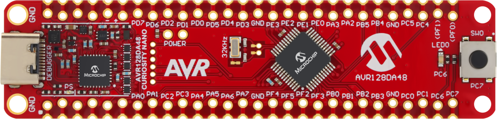
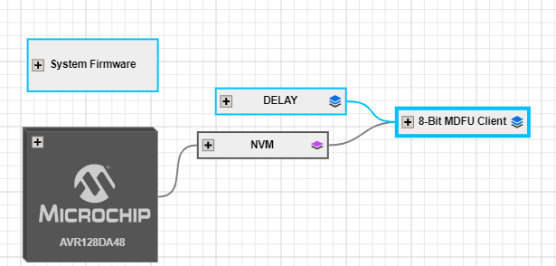
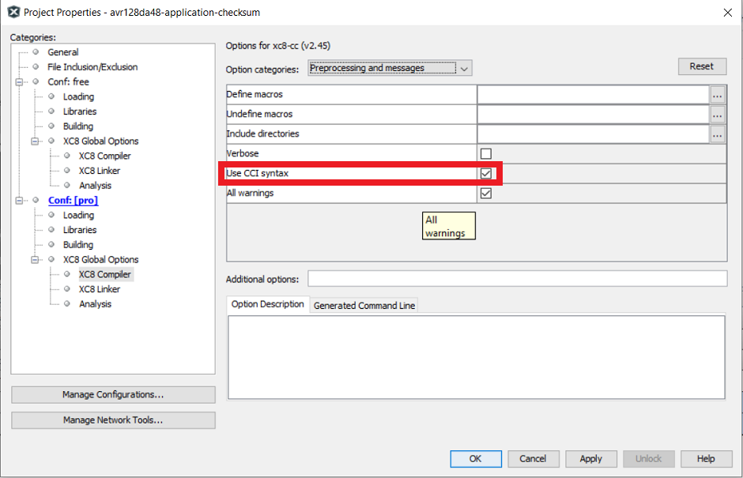
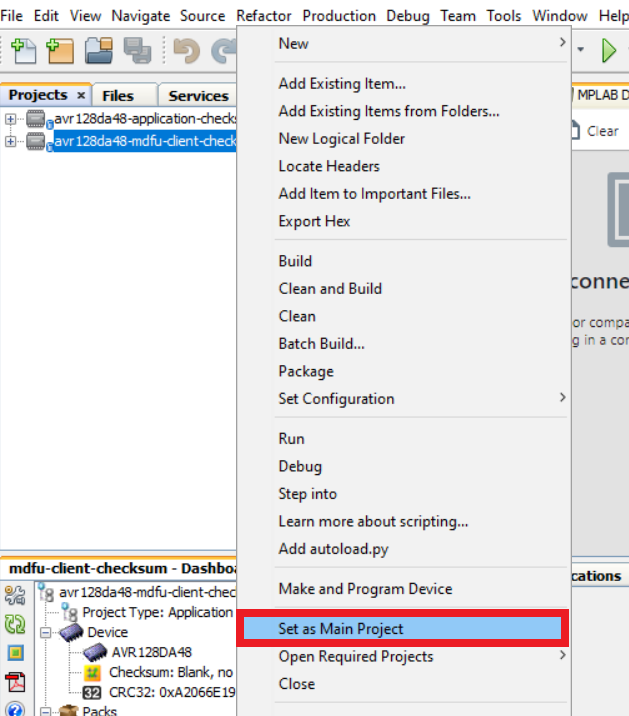
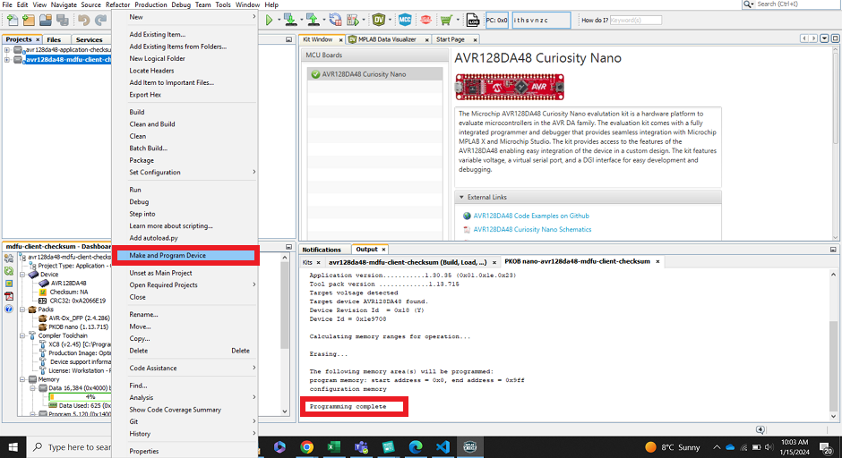
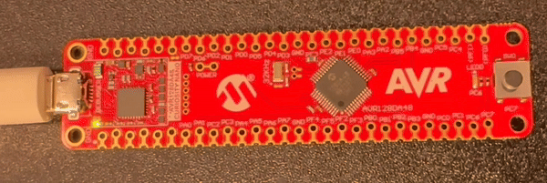

<!-- Please do not change this logo with link -->

[](https://www.microchip.com)

# Getting Started With the 8-bit MDFU Client for AVR128DA48 Using MPLAB&reg; X

This example demonstrates how to utilize the MPLAB Code Configurator (MCC) generated code to set up various basic Microchip Device Firmware Update (MDFU) bootloader solutions for the AVR128DA48 Curiosity Nano Evaluation board.

The MDFU is a firmware update system that employs a device-independent host application to update application firmware. The application image loaded into the host adheres to a custom file format, incorporating device and application-specific parameters necessary for the update. This repository offers a foundational setup to configure and customize the MCC Melody 8-Bit MDFU Client library on the AVR128DA48 Curiosity Nano Evaluation board, along with instructions for executing the examples.

This example demonstrates:
- How to configure the 8-Bit MDFU Client Library in MCC Melody for different verification schemes
- How to create a simple Blinky LED application
- How to use the [`pyfwimagebuilder`](https://pypi.org/project/pyfwimagebuilder/) command line interface to convert the application hex file into an application image
- How to use the [`pymdfu`](https://pypi.org/project/pymdfu/) command line interface to update the application firmware

## Related Documentation

- [AVR128DA48 Family Product Page](https://www.microchip.com/en-us/product/AVR128DA48)
- [8-Bit MDFU Client v1.1.0 Release Note](https://onlinedocs.microchip.com/v2/keyword-lookup?keyword=RELEASE_NOTES_8BIT_MDFU_CLIENT_LIBRARY&version=latest&redirect=true)
- [Getting Started Document, API Reference and Update Image Specification](https://onlinedocs.microchip.com/v2/keyword-lookup?keyword=8BIT_MDFU_CLIENT&version=latest&redirect=true)
- [8-Bit MDFU Client Known Issues List](https://onlinedocs.microchip.com/v2/keyword-lookup?keyword=KNOWN_ISSUES_8BIT_MDFU_CLIENT&version=latest&redirect=true)

## Software Used

- [MPLAB® X IDE 6.20.0](https://www.microchip.com/en-us/tools-resources/develop/mplab-x-ide)
- [MPLAB® XC8 2.50.0](https://www.microchip.com/en-us/tools-resources/develop/mplab-xc-compilers)
- [MPLAB® Code Configurator (MCC) 5.5.1](https://www.microchip.com/mplab/mplab-code-configurator)
- [MPLAB® Code Configurator (MCC) Device Libraries PIC10/12/16/18 microcontrollers (MCUs)](https://www.microchip.com/en-us/tools-resources/develop/libraries/microchip-libraries-for-applications)
- [Python 3.8 or later](https://www.python.org/downloads/)
- [pyfwimagebuilder v1.0.1](https://pypi.org/project/pyfwimagebuilder/)
- [pymdfu v2.4.0](https://pypi.org/project/pymdfu/)

## Hardware Used

- AVR128DA48 Curiosity Nano [(DM164151)](https://www.microchip.com/en-us/development-tool/DM164151)

[](images/230928-mcu8-photo-dm164151-front-transparent.PNG)

## Setup

The following project setup steps will demonstrate the basic configuration steps for setting up the 8-Bit MDFU Client with Universal Asynchronous Receiver and Transmitter (UART) communication. The configuration bits, clock, Non-Volatile Memory (NVM), and General Purpose Input/Output (GPIO) settings will be consistent across all examples in this repository and any deviations from this setup due to the chosen communication protocol will be described individually later in this section.

> **Tip**: The values mentioned below are relevant for AVR128DA48, and in case of any other device, these values need to be updated according to the device specifications.

### [Client Setup](#client-setup)
[](images/ProjectConfigurationOverview.PNG)

**Clock Control**
- Prescaler Enable: Disabled
- Internal Oscillator Frequency: 8_MHz or higher

[](images/ClockSetup.PNG)

**Configuration Bits**

On Configuration Bits UI, configure the BOOT FUSE to an acceptable size.
For example, if the Program Flash Memory size is 0x20000, then the BOOT FUSE for an AVR&reg; device with a page size of 512 would need to be 254 (one less than the MAX). This will initialize the bootloader code partition to be in the address range from 0x00 to 0x1FC00. This will leave one page in the application code partition.

For AVR128DA48,
- BOOTSIZE: 254

The value needs to be set to 254 only initially, to know the Flash memory consumed by the bootloader. Upon configuring and building bootloader for the first time, this size can be reduced according to the memory consumed by bootloader. This value can then be configured to set application address as the next valid page start address after the amount of memory consumed by bootloader.

For example, if the number of bytes consumed by bootloader is 0x1367h, then setting the BOOTSIZE to 10 will configure application start address to 0x1400h, allowing the bootloader Flash space to be enough to successfully store the bootloader code.

[](images/ConfigBitsSetup.PNG)

**NVM**
- Generate Flash APIs: Enabled
- Generate EEPROM APIs: Enabled
- Generate Signature Row APIs: Enabled

[](images/NVMSetup.PNG)

**8-Bit MDFU Client**

This section will guide you through the setup process for UART communication. For more details on configuring and operating other communication protocols, please refer to the pages listed below
- [SPI Communication](spi/README.md)
- [I<sup>2</sup>C Communication](i2c/README.md)

**8-Bit MDFU Client with UART Communication**

- Communication Protocol: UART
- Application Start Address: Different for each project based on the verification selected
- Device ID: 0x1E9708 (automatically added)
- I/O Pin Indicator: Enabled
- I/O Pin Entry: Enabled
- Memory Verification: Assigned based on the example project naming convention

> **Tip**: This example is for Checksum verification.

[](images/MDFUClientSetup.PNG)

**UART**
- Custom Name: SERCOM
- Requested Baudrate: 9600
- Parity: None
- Data Size: 8
- Stop Bits: 1
- Flow Control Mode: None
- Redirect Printf to UART: Disabled
- Interrupt Driven: Disabled

[](images/UARTDriverSetup.PNG)

**USART PLIB**
- Enable UART Receiver: Enabled
- Enable UART Transmitter: Enabled

[](images/UARTPLIBSetup.PNG)

**UART Pins**
- UART TX: PC0
- UART RX: PC1
  - Pull-up: Enabled

[](images/UARTPortsSetup.PNG)

**8-Bit MDFU Client I/O**

Upon enabling both I/O Options from the 8-Bit MDFU Client module, the INDICATE and ENTRY pin rows will be automatically loaded in the **Pin Grid View** tab. 

Configure these pins as follows:

- BOOT INDICATE: PC6
  - Start High: Enabled
- BOOT ENTRY: PC7
  - Pull-up: Enabled

[](images/IOPortSetup.PNG)

[](images/IOPinsSetup.PNG)

**Updating Application Start Address**

- At this point, the BOOTFUSE configuration bit is configured to 254 which results in application start address to be configured as:

[](images/MaxBootSize.png)

- After this, upon generating and performing clean and build, the bytes of memory consumed by the bootloader can be observed in the dashboard window

[](images/BuildMemoryConsumption.png)

- Next step is to update the BOOTSIZE fuse so that the application start address will be the next page start address in Flash after the memory consumed by the bootloader code. For more information on the BOOTSIZE and CODESIZE fuses, go to *NVMCTRL>Functional Description>Memory Organization* section in the [AVR128DA48 data sheet](https://www.microchip.com/en-us/product/AVR128DA48).

- Since this code example consumes 0x13A0, the application start address needs to be configured to 0x1400. This is achieved by setting the BOOTSIZE to 10.

[](images/UpdatedBootSize.png)

- After updating the application start address, final configurations must be as mentioned below 

[](images/MDFUClientSetup.PNG)


**8-Bit MDFU Client Project Properties**

Configure the linker options to ensure the bootloader is compiled within the BOOT partition. The specific steps for this configuration vary based on the compiler being used.

> **Tip**: These values can be copied from the "Linker Options" section of 8-Bit MDFU Client MCC UI.

*AVR-GCC:*

- Navigate to the *Project Properties>Avr GCC (Global Options)>avr-ld>Additional options*
- Apply the below settings where `<Application Start Address>` is the start address of the application.
 ```
  -Wl,--defsym,__TEXT_REGION_LENGTH__=<Application Start Address>
 ```

*XC8:*

- Navigate to the *Project Properties>XC8 Linker>Additional Options>Extra Linker Options*
- Apply the below settings where `<Application Start Address>` represents the start address of the application
 ```
  -Wl,--defsym,__TEXT_REGION_LENGTH__=<Application Start Address>
 ```

Replace the `<Application Start Address>` to the Application Start Address value as configured in the MDFU Client UI.

[](images/LinkerSettings.PNG)

---
### [Application Setup](#application-setup)

This section is consistent for any example created in this repository.

[](images/AppConfigurationOverview.PNG)

**I/O Pins**
- GPIO Output: PC6
  - Custom Name: LED

- GPIO Input: PC7
  - Custom Name: BTN

[](images/AppPortSetup.PNG)

[](images/LEDSetup.PNG)

**End Application**

 * Open `main.c`
 * Add logic inside the while loop to toggle the on-board LED with a 200 ms rate
 * Add logic under that to reset the device if the BTN is pressed
```
while(1)
{    
    LED_Toggle();
    DELAY_milliseconds(200U);

    if (BTN_GetValue() == 0U)
    {
        RSTCTRL_reset();
    }
}
```

 * Include the `delay.h` header file
 * At the top of the main file before the main function, copy and paste the following code:

 > **Tip**: The address presented below in the __at() is PROGMEM_SIZE - 2 since the hash size used is two bytes. In case of CRC32, the 0xFFFF at the end will be 0xFFFFFFFF, since CRC32 requires four bytes instead of two.
```
#include <stdint.h>
#ifdef __XC8__
#include <xc.h>
#endif

volatile const uint16_t
#ifdef __XC8__
__at(0x1FFFE)
#endif
applicationFooter __attribute__((used, section("application_footer"))) = 0xFFFF;
```

**Project Properties**

*Linker Settings*

This step is different depending on the used compiler.

*AVR-GCC*
 * When using the AVR-GCC compiler, open the project properties and apply the below settings
   ```
    - avr-ld>Memory Settings>FLASH segment> .text=<Application_Start_Address_in_words>
    - avr-ld>Additional Options=-Wl,-u,applicationFooter
   ```

> **Tip**: AVR-GCC accepts word addresses, so if it is set 0x4000 in the bootloader, it must be set to 0x2000 here.

*XC8*
 * When using the XC8 compiler, open the project properties and apply the below settings:

  Go to *XC8 Global Options>XC8 Linker>Option Categories* and select 'Additional options' from the drop-down menu. Copy and paste the following line into the **Extra linker options** box:

  *-Ttext=\<Application Start Address\> -Wl,-u,applicationFooter*

  [](images/appLinkerSettings.PNG) 

  Go to *XC8 Global Options>XC8 Compiler>Option Categories* and select 'Preprocessing and messages' from the drop-down menu. Check the box next to **Use CCI Syntax**.
   
  [](images/appCompilerSettings.PNG)

**Post Build Actions**

 * Create a new script file called `postBuild.bat` (for Windows) or `postBuild.sh` (for Mac or Linux)

   - The postBuild file can be created by right-clicking the project folder in the **MPLAB X Projects** tab and navigating to:
    *New>Other...> Other>Empty File*
   - Enter the name postBuild for File Name and add your required extension (`.bat` or `.sh`)
   - Click **Finish**
   - A new file named `postBuild.bat` or `postBuild.sh` will be displayed
   - Copy the following lines into the script file:
      1. To fill unused space:

          `hexmate r0-FFFFFFFF,%1 -O%1 -FILL=w1:0xFF@0x1400:0x1FFFF` - 0x1400 corresponds to the application start address and 0x1FFFF to Flash End Address(Flash size -1).
        
        2. To perform the calculation and store the result: 
        
        > **Tip**: Reset Vector and Status Byte do not require this line.

   
      |Verification | Code | Description |
      |- |- |- |
      |Checksum | hexmate %1 -O%1 +-CK=1400-1FFFD@1FFFEg2w-2 | 0x1400 corresponds to the application start address and 0x1FFFE is to Flash size - 2, since the checksum requires two bytes. This command is taking the range from 0x1400-@1FFFD of the application, calculating its checksum and storing it at 0x1FFFE. |
      |CRC16 | hexmate %1 -O%1 +-CK=1400-1FFFD@1FFFE+FFFFg5w-2p1021 |0x1400 corresponds to the application start address and 0x1FFFE is to Flash size - 2, since the CRC16 hash requires two bytes. This command is taking the range from 0x1400-@1FFFD of the application, calculating CRC16 hash on the data and storing it at 0x1FFFE. |
      |CRC32 |hexmate %1 -O%1 +-CK=1400-1FFFB@1FFFC+FFFFFFFFg-5w-4p04C11DB7 |0x1400 corresponds to the application start address and 0x1FFFC is to Flash size - 4, since CRC32 hash requires four bytes. This command is taking the range from 0x1400-@1FFFB of the application, calculating CRC32 hash on the data and storing it at 0x1FFFC. |

   - Add the path to MPLAB X which contains the hexmate application to the environment variable **PATH**
   
    Example path (default):  C:\Program Files\Microchip\MPLABX\v6.20\mplab_platform\bin

    > **Tip**: More information on hexmate can be found in the Hexmate User Guide packaged with the compiler docs. It can be found in the docs folder for compiler version under use. 
 
 * Compile the project
 * Running the postBuild script
     
     Open a command prompt window within the project folder and run the following command with appropriate parameters:
   - Command Format: <code>postBuild${ShExtension} ${ImagePath}</code>
   - Example path: ```.\postBuild.bat avr128da48-application-crc32.X.production.hex```

## Operation
This section is a walkthrough on how to run the examples in this repository. This example shows how to execute the Checksum verification example and update the device Flash memory with the Checksum application image to demonstrate a successful device firmware update (DFU). For additional communication protocol operation information, refer to the pages listed below:
- [SPI Example Operation](spi/README.md#operation)
- [I<sup>2</sup>C Example Operation](i2c/README.md#operation)

**8-Bit MDFU Client Operation**

1. Open the MDFU client project.

[](images/openProjectMDFU.PNG)

2. Set MDFU client project as Main Project.

[](images/setAsMainProject.png)

3. Right click, then select Clean and Build.

[](images/CleanAndBuildMDFU.png)

4. Program the MDFU client project.

[](images/ProgramMDFU.png)

**Bootloader Operation After Initial Programming**

After the initial programming, the LED must be on.

[](images/AVR128DA48_BootMode.png)

**Application Operation**
1. Open the application project that is configured for the selected verification scheme.

[](images/openProjectApp.PNG)

2. Set the application project as the Main Project.

[](images/setAppAsMainProject.png)

3. Build the required application project.

- Navigate to the Building section of the application Project Properties window and enable the "Execute this line after build" checkbox

[](images/EnablePostBuildApp.PNG)

- Right click the project name, then select Clean and Build

[](images/CleanAndBuildApp.png)

4. Build the Application Image File using [pyfwimagebuilder](https://pypi.org/project/pyfwimagebuilder/).

- To build the application image files, navigate to the Projects tab and right click *Important Files>`build_free_image.bat`* for Windows or *Important Files>`build_free_image.sh`* for Mac and Linux
- Select Run

[](images/RunBuildScript.PNG)

> **Tip**: The configuration TOML file is generated by the MDFU Client project under `mcc_generated_files\bootloader\configurations`.

[](images/toml_PATH.png)

**Example Command:**

`pyfwimagebuilder build -i "application_hex_file.hex"  -c "bootloader_configuration.toml" -o output.img`

[](images/BuildTheImage.png)

5. Use the [pymdfu](https://pypi.org/project/pymdfu/) host tool to transfer the application image file to the bootloader.

> **Tip**: The COM port of the MCU is found using the MPLAB Data Visualizer.

- To run the update with the examples, navigate to the Project tab and right click, *Important Files>`pymdfu_update.bat`* for Windows or *Important Files>`pymdfu_update.sh`* for Mac and Linux. Double click to open the file.
- Edit the port number to the CDC port name that is assigned to the Curiosity Nano device
- Then right click the script and select Run

[](images/runUpdateScript.PNG)

**Example Command:**

`pymdfu update --tool serial --image ./output.img --baudrate 9600 --port COM##`

[](images/SendTheImage.PNG)

**Application Has Been Updated Successfully**

[](images/AVR128DA48_AppMode.gif)

**Example Application Features:**

1. Blink the on-board LED at a rate of 200 ms.
2. Pressing the button on the Curiosity Nano and holding it down will force entry into bootloader, allowing a new application to be transferred.

## Summary

This repository demonstrates how to configure the 8-Bit MDFU Client library in MCC to enable device firmware updates over UART on a AVR128DA48 Curiosity Nano.

## Contents

- [Back to Related Documentation](#related-documentation)
- [Back to Software Used](#software-used)
- [Back to Hardware Used](#hardware-used)
- [Back to Setup](#setup)
- [Back to Operation](#operation)
- [Back to Summary](#summary)
- [Back to Top](#getting-started-with-the-8-bit-mdfu-client-for-avr128da48-using-mplab-x)
