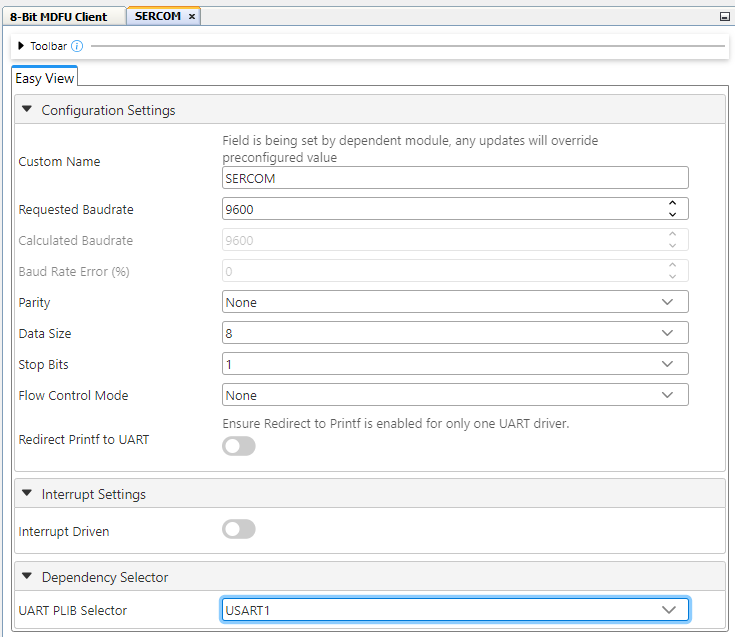
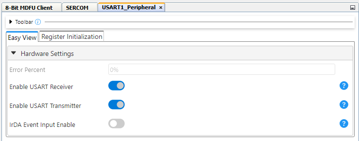
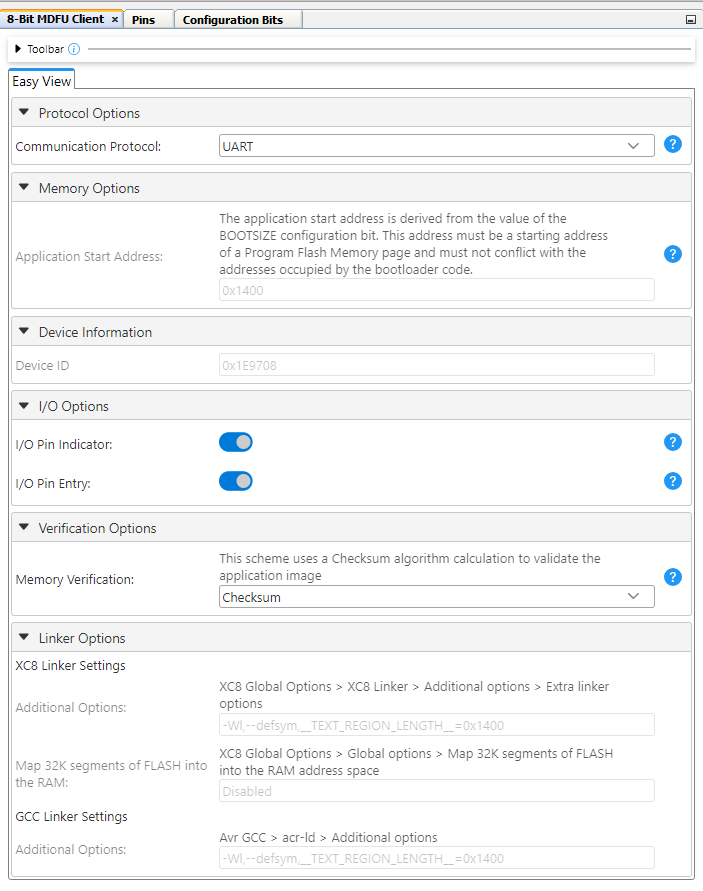
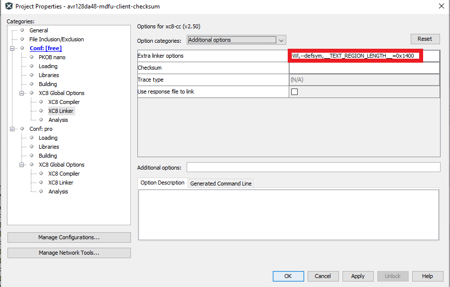
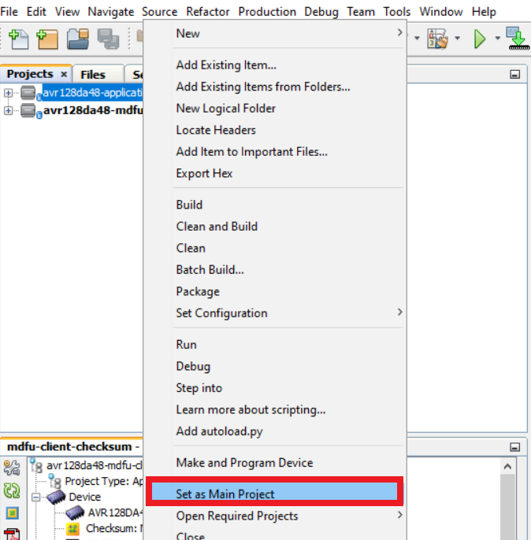
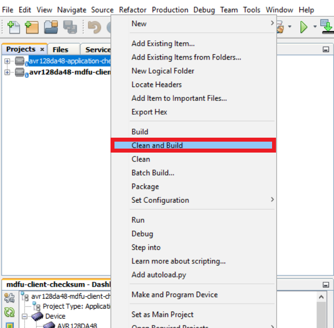
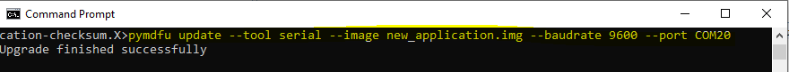

<!-- Please do not change this logo with link -->

[](https://www.microchip.com)

# Getting Started With the 8-bit MDFU Client for AVR128DA48 Using MPLAB&reg; X

This is an example on how to use the MPLAB Code Configurator (MCC) generated code for configuring several basic Microchip Device Firmware Update (MDFU) bootloader solutions for the AVR128DA48 Curiosity Nano Evaluation board.

The MDFU is a device firmware update ecosystem that uses a device agnostic host application to update the application firmware. The application image that is loaded into the host follows a custom file format that includes the device and application-specific parameters needed to perform the update. This repository provides the basic starting point to configure and customize the MCC Melody 8-Bit MDFU Client library on the AVR128DA48 Curiosity Nano Base for Click boards™ and instructions for running the examples.

This example will demonstrate:
- How to configure the 8-Bit MDFU Client Library in MCC Melody for different verification schemes
- How to create a simple Blinky LED application
- How to use the [`pyfwimagebuilder`](https://pypi.org/project/pyfwimagebuilder/) command line interface to convert application hex file into application image
- How to use the [`pymdfu`](https://pypi.org/project/pymdfu/) command line interface to update the application firmware

---

## Related Documentation

- [AVR128DA48 Family Product Page](https://www.microchip.com/en-us/product/AVR128DA48)
- [8-Bit MDFU Client v1.0.0 Release Notes](https://onlinedocs.microchip.com/v2/keyword-lookup?keyword=RELEASE_NOTES_8BIT_MDFU_CLIENT_LIBRARY&version=latest&redirect=true)
- [8-Bit MDFU Client v1.0.0 Getting Started Guide](https://onlinedocs.microchip.com/v2/keyword-lookup?keyword=8BIT_MDFU_CLIENT&version=latest&redirect=true)
- [8-Bit MDFU Client v1.0.0 API Documentation](https://onlinedocs.microchip.com/v2/keyword-lookup?keyword=8BIT_MDFU_CLIENT&version=latest&redirect=true)
- [8-Bit MDFU Client v1.0.0 Known Issues List](https://onlinedocs.microchip.com/v2/keyword-lookup?keyword=KNOWN_ISSUES_8BIT_MDFU_CLIENT&version=latest&redirect=true)

## Software Used

- [MPLAB X IDE 6.20.0](https://www.microchip.com/en-us/tools-resources/develop/mplab-x-ide)
- [MPLAB XC8 2.46.0](https://www.microchip.com/en-us/tools-resources/develop/mplab-xc-compilers)
- [MPLAB Code Configurator (MCC) 5.5.1](https://www.microchip.com/mplab/mplab-code-configurator)
- [MPLAB Code Configurator (MCC) Device Libraries PIC10 / PIC12 / PIC16 / PIC18 MCUs](https://www.microchip.com/en-us/tools-resources/develop/libraries/microchip-libraries-for-applications)
- [Python 3.8 or later](https://www.python.org/downloads/)
- [pyfwimagebuilder v1.0.1.14](https://pypi.org/project/pyfwimagebuilder/)
- [pymdfu v1.0.1.5](https://pypi.org/project/pymdfu/)

## Hardware Used

- AVR128DA48 Curiosity Nano [(DM164151)](https://www.microchip.com/en-us/development-tool/DM164151)

[](images/230928-mcu8-photo-dm164151-front-transparent.PNG)

## Setup

The following project setup is the same for all the example project pairs. If something goes wrong while running these examples, confirm that the settings in the projects are consistent with the options seen in this section.

 **Note**: The values mentioned below are relevant for AVR128DA48, and in case of any other device, these values need to be updated according to the device specifications.

### Client Setup
[](images/ProjectConfigurationOverview.PNG)

**Clock Control**
- Prescaler enable: Disabled
- Internal Oscillator Frequency: 8_MHz or higher

[](images/ClockSetup.PNG)

**Configuration Bits**

On Configuration Bits UI, configure the BOOT FUSE to an acceptable size.
For example, if the Program Flash Memory size is 0x20000, then the BOOT FUSE for an AVR device with a page size of 512 would need to be 254 (one less than the MAX). This will initialize the bootloader code partition to be in the address range from 0x00 to 0x1FC00. This will leave one page in the application code partition.

For AVR128DA48,
- BOOTSIZE: 254

The value needs to be set to 254 only initially, to know the FLASH memory consumed by the bootloader. Upon configuring and building bootloader for the first time, this size can be reduced according to the memory consumed by bootloader. This value can then be configured to set application address as the next valid page start address after the amount of memory consumed by bootloader.

For example,
If number of bytes consumed by bootloader are 0x1367h then setting BOOTSIZE to 10 will configure application start address to 0x1400h, allowing the bootloader Flash space to be enough to successfully store the bootloader code.

[](images/ConfigBitsSetup.PNG)

**NVM**
- Generate Flash APIs: Enabled
- Generate EEPROM APIs: Enabled
- Generate Signature Row APIs: Enabled

[](images/NVMSetup.PNG)

**UART**
- Custom Name: UART2
- Requested Baudrate: 9600
- Calculated Baudrate: 9600
- Baud Rate Error (%): 0.00
- Parity: None
- Data Size: 8
- Stop Bits: 1
- Flow Control Mode: None
- Redirect Printf to UART: Disabled
- Interrupt Driven: Disabled

[](images/UARTDriverSetup.PNG)

**USART PLIB**
- Enable UART Receiver: Enabled
- Enable UART Transmitter: Enabled

[](images/UARTPLIBSetup.PNG)

**UART Pins**
- UART TX: RB5
- UART RX: RB4

[](images/UARTPortsSetup.PNG)

**8-Bit MDFU Client**
- Communication Protocol: UART
- FUSE-BOOTSIZE: Different for each project based on the verification selected
- FUSE-CODESIZE: Different for each project based on the verification selected
- Device ID: 0x1E9708
- I/O Pin Indicator: Enabled
- I/O Pin Entry: Enabled
- Memory Verification: Assigned Based on Example Project Naming Convention

**Tip**: Easiest way to get correct device ID is to connect your device and use the "Refresh Debug Tool Status" button in the Dashboard left panel on MPLAB X IDE. Upon clicking on the button and selecting correct PKOB Nano, it prints out the device ID with other information in the output window.

[](images/RefreshDebugToolStatus.png)

**8-Bit MDFU Client I/O**

Upon adding the MDFU Client Library, these pins will be automatically loaded in the PIN configuration section.

These pins must configured as follows:

- BOOT INDICATE: RC6
- BOOT ENTRY: RC7

[](images/IOPortSetup.PNG)

- BOOT INDICATE: Start High
- BOOT ENTRY: Weak Pullup

[](images/IOPinsSetup.PNG)

*Example for Checksum Verification*

**Updating Application Start Address**

This is an important step to ensure that the bootloader and application FLASH sections are configured to provide maximum space for the application while decreasing the bootloader section to be as close to the memory consumed by the bootloader code as possible.

- At this point, as mentioned in the configuration bits section of [Client Setup](#client-setup), the BOOTFUSE configuration bit is configured to 254 which results in application start address to be configured as 
[](images/MaxBootSize.png)

- After this, upon generating and performing clean and build, the bytes of memory consumed by bootloader can be observed in dashboard window.

[](images/BuildMemoryConsumption.png)

- Next step is to update the BOOTSIZE fuse such that the application start address will be the next page start address in FLASH after the memory consumed by bootloader code. More information on BOOTSIZE and CODESIZE fuses can be found in the [AVR128DA48 datasheet](https://www.microchip.com/en-us/product/AVR128DA48) in the *NVMCTRL -> Functional Description -> Memory Organization section.*

- Since in this example, code consumes 0x13A0, the application start address needs to be configured to 0x1400. This is achieved by setting the BOOTSIZE to 10.

[](images/UpdatedBootSize.png)

- After updating the application start address, final configurations must be as mentioned below 

[](images/MDFUClientSetup.PNG)


**8-Bit MDFU Client Project Properties**

Set the linker options to restrict the bootloader compilation to the BOOT partition.
This step is different depending on the used compiler.

AVR-GCC:
 ```
   When using the AVR-GCC compiler, open the project properties and apply the below settings
   avr-ld>Additional options>-Wl,--defsym,__TEXT_REGION_LENGTH__=<Application Start Address>
 ```
XC8:

When using the XC8 compiler, open the project properties and apply the below settings
 ```
   XC8 Linker>Additional options>Extra Linker Options>-Wl,--defsym,__TEXT_REGION_LENGTH__=<Application Start Address>
 ```

Replace the <Application Start Address> to the Application Start Address value as configured in the MDFU Client UI.

[](images/LinkerSettings.PNG)

---
### Application Setup

DELAY driver needs to be added for the application project.

[](images/AppConfigurationOverview.PNG)

**I/O Pins**
- GPIO Output: RC6

[](images/AppPortSetup.PNG)
- Custom Name: LED

[](images/LEDSetup.PNG)

**Project Properties**

Linker Additional Options

*Linker Settings*

This step is different depending on the used compiler.

*AVR-GCC*
 * When using the AVR-GCC compiler, open the project properties and apply the below settings
   ```
    - avr-ld>Memory Settings>FLASH segment> .text=<Application_Start_Address_in_words>
    - avr-ld>Additional Options=-Wl,-u,applicationFooter
   ```
 **Note**: AVR-GCC accepts word addresses, so if it is set 0x4000 in the bootloader, it must be set to 0x2000 here.

*XC8*
 * When using the XC8 compiler, open the project properties and apply the below settings
   ```
     Linker>Additional Options>Extra Linker Options=-Ttext=<Application Start Address> -Wl,-u,applicationFooter
   ```

     [](images/appLinkerSettings.PNG) 
   ```
    Compiler>Preprocessing and Messages. Check the **Use CCI Syntax** checkbox
   ```
     [](images/appCompilerSettings.PNG)

*End Application*
 * Open main.c and add logic inside while loop to toggle the onboard LED with a 200 ms rate:
```
while(1)
{    
    LED_Toggle();
    DELAY_milliseconds(200);
} {code}
```

 * Include the <code style="font-family: 'Courier New', Courier, monospace;">delay.h</code> header file
 * At the top of the main file before the main function, copy and paste the following code:

 **Tip**: The address presented below in the __at() is PROGMEM_SIZE - 2 since the hash size used is two bytes. In case of CRC32, the 0xFFFF at the end will be 0xFFFFFFFF, since CRC32 requires four bytes instead of two.
```
#include <stdint.h>
#ifdef __XC8__
#include <xc.h>
#endif

volatile const uint16_t
#ifdef __XC8__
__at(0x1FFFE)
#endif
applicationFooter __attribute__((used, section("application_footer"))) = 0xFFFF;
{code}
```

 * Create a new script file called <code style="font-family: 'Courier New', Courier, monospace;">postBuild.bat</code> (for Windows) or <code style="font-family: 'Courier New', Courier, monospace;">postBuild.sh</code> (for Mac or Linux).

   - The postBuild file can be created by right-clicking the project folder in the **MPLAB X Projects** tab and navigating to:
    *New>Other...> Other>Empty File*
   - Enter the name postBuild for File Name and add your required extension (.bat or .sh).
   - Click Finish
   - A new file named "postBuild.bat" or "postBuild.sh" will be displayed.
   - Copy the following lines into the script file:
        To Fill Unused Space: 
       
        ```hexmate r0-FFFFFFFF,%1 -O%1 -FILL=w1:0xFF@0x1400:0x1FFFF```
        0x1400 corresponds to the application start address and 0x1FFFF to Flash End Address(Flash size -1).
        
        To perform the calculation and store the result: 
        Reset Vector and Status Byte do not require this line.

        Checksum:
        
        ```hexmate %1 -O%1 +-CK=1400-1FFFD@1FFFEg2w-2```
        0x1400 corresponds to the application start address and 0x1FFFE is to Flash size - 2, since checksum requires two bytes.
        This command is taking range from 0x1400-@1FFFD of the application, calculating its checksum and storing it at 0x1FFFE using algorithm checksum.
        
        CRC16:
        
        ```hexmate %1 -O%1 +-CK=1400-1FFFD@1FFFE+FFFFg5w-2p1021``` where
        0x1400 corresponds to the application start address and 0x1FFFE is to Flash size - 2, since CRC16 hash requires two bytes.
        This command is taking range from 0x1400-@1FFFD of the application, calculating CRC16 hash on the data and storing it at 0x1FFFE using algorithm CRC16.

        CRC32:
        
        ```hexmate %1 -O%1 +-CK=1400-1FFFB@1FFFC+FFFFFFFFg-5w-4p04C11DB7``` where
        0x1400 corresponds to the application start address and 0x1FFFC is to Flash size - 4, since CRC32 hash requires four bytes.
        This command is taking range from 0x1400-@1FFFB of the application, calculating CRC16 hash on the data and storing it at 0x1FFFC using algorithm CRC32.

   - Add the path to MPLAB X which contains hexmate application to the environment variable **PATH**
   
      <code>Example path(default):  *C:\Program Files\Microchip\MPLABX\v6.15\mplab_platform\bin*</code>

     **Note**: More information on hexmate can be found in the Hexmate User Guide packaged with the compiler docs. It can be found in the docs folder for compiler version under use. 
 
 * Compile the project
 * Running the postBuild script
     
     Open an command prompt and run the following command in command prompt with appropriate parameters.
   - Command Format: <code>postBuild${ShExtension} ${ImagePath}</code>
   - Example path: ```.\postBuild.bat avr128da48-application-crc32.X.production.hex```
      
      

## Operation
This section is a walkthrough on how to run the examples in this repository. This example shows how to execute the Checksum verification example and update the device Flash memory with the Checksum application image to demonstrate a successful device firmware update (DFU).

**8-Bit MDFU Client Operation**

1. Open the MDFU Client Project.

[](images/openProjectMDFU.PNG)

2. Set MDFU Client Project as Main Project.

[](images/setAsMainProject.png)

3. Right click, then select Clean and Build.

[](images/CleanAndBuildMDFU.png)

4. Program the MDFU Client Project.

[](images/ProgramMDFU.png)

**Bootloader Operation After Initial Programming**

After the initial programming, the LED must be on.

[](images/AVR128DA48_BootMode.png)

**Application Operation**
1. Open the Application Project that is configured for the selected verification scheme.

[](images/openProjectApp.PNG)

2. Set the application project as the Main Project.

[](images/setAppAsMainProject.png)

3. Build the required Application project.

Right click, then select Clean and Build

[](images/CleanAndBuildApp.png)

4. Build the Application Image File using **pyfwimagebuilder**.

**Tip**: The configuration TOML file is generated by the MDFU Client project under *\mcc_generated_files\bootloader\configurations*

[](images/toml_PATH.png)

**Example Command:**

`pyfwimagebuilder build -i "application_hex_file.hex"  -c "bootloader_configuration.toml" -o output.img`

[](images/BuildTheImage.png)

5. Use the **pymdfu** host tool to transfer the application image file to the bootloader.

**Tip**: The COM port of the MCU is found using the MPLAB Data Visualizer.

**Example Command:**

`pymdfu update serial ./output.img --baudrate 9600 --port COM##`

[](images/SendTheImage.PNG)

**Application Has Been Updated Successfully**

[](images/AVR128DA48_AppMode.gif)

## Summary

This repository demonstrates how to configure the 8-Bit MDFU Client library in MCC to enable device firmware updates over UART on a AVR128DA48 Curiosity Nano.

## Contents

- [Back to Related Documentation](#related-documentation)
- [Back to Software Used](#software-used)
- [Back to Hardware Used](#hardware-used)
- [Back to Setup](#setup)
- [Back to Operation](#operation)
- [Back to Summary](#summary)
- [Back to Top](#getting-started-with-the-8-bit-mdfu-client-for-avr128da48-using-mplab®-x)
