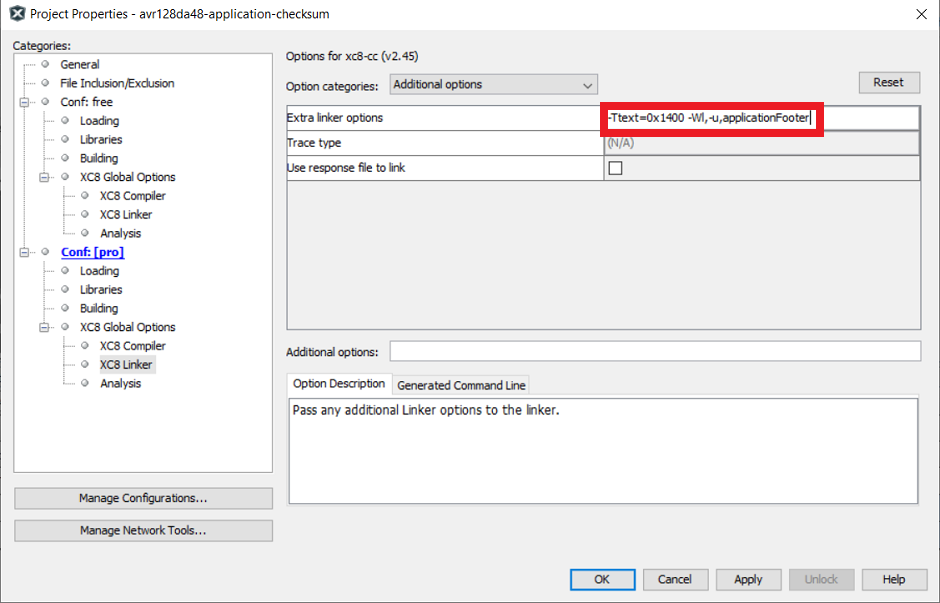
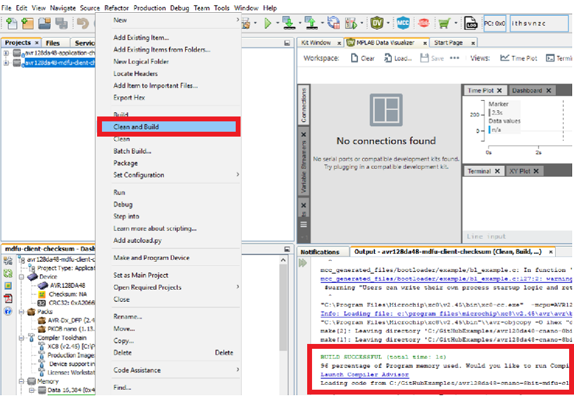

<!-- Please do not change this logo with link -->

[](https://www.microchip.com)

# Getting Started With the 8-bit MDFU Client for AVR128DA48 Using MPLAB X

This is an example on how to use the MPLAB Code Configurator (MCC) generated code for configuring several basic Microchip Device Firmware Update (MDFU) bootloader solutions for the AVR128DA48 Curiosity Nano Evaluation board.

The MDFU is a device firmware update ecosystem that uses a device agnostic host application to update the application firmware. The application image that is loaded into the host follows a custom file format that includes the device and application-specific parameters needed to perform the update. This repository provides the basic starting point to configure and customize the MCC Melody 8-Bit MDFU Client library on the AVR128DA48 Curiosity Nano Base for Click boards™ and also provides instructions for running the examples.

This example will demonstrate:
- How to configure the 8-Bit MDFU Client Library in MCC Melody for different verification schemes
- How to create a simple Blinky LED application
- How to use the [`pyfwimagebuilder`](https://pypi.org/project/pyfwimagebuilder/) command line interface to convert application hex file into application image
- How to use the [`pymdfu`](https://pypi.org/project/pymdfu/) command line interface to update the application firmware.

---

## Related Documentation

- [AVR128DA48 Family Product Page](https://www.microchip.com/en-us/product/AVR128DA48)
- [8-Bit MDFU Client Getting Started](https://onlinedocs.microchip.com/oxy/GUID-67539092-2179-43C1-8600-118A85E49693-en-US-2/index.html)
- [8-Bit MDFU Client v1.0.0-beta.1 Release Note](https://onlinedocs.microchip.com/oxy/GUID-9CE46BA1-9CDF-4B9C-9C73-4793B27ED320-en-US-2/index.html)
- [8-Bit MDFU Client v1.0.0-beta.1 API Documentation](https://onlinedocs.microchip.com/oxy/GUID-01EC9542-92FF-436D-91FB-7CBEEE66D701-en-US-2/index.html)

## Software Used

- [MPLAB X IDE 6.15.0](https://www.microchip.com/en-us/tools-resources/develop/mplab-x-ide)
- [MPLAB XC8 2.45.0](https://www.microchip.com/en-us/tools-resources/develop/mplab-xc-compilers)
- [MPLAB Code Configurator (MCC) 5.4.1](https://www.microchip.com/mplab/mplab-code-configurator)
- [MPLAB Code Configurator (MCC) Device Libraries AVR AND ATtiny MCUs](https://www.microchip.com/mplab/mplab-code-configurator)
- [Python 3.8 or later](https://www.python.org/downloads/)
- [pyfwimagebuilder v1.0.1.14](https://pypi.org/project/pyfwimagebuilder/)
- [pymdfu v1.0.1.5](https://pypi.org/project/pymdfu/)

## Hardware Used

- AVR128DA48 Curiosity Nano [(DM164151)](https://www.microchip.com/en-us/development-tool/DM164151)

[](images/230928-mcu8-photo-dm164151-front-transparent.PNG)

## Setup

The following project setup is the same for all the example project pairs. If something goes wrong while running these examples, confirm that the settings in the projects are consistent with the options seen in this section.

### Client Setup
[](images/ProjectConfigurationOverview.PNG)

**Clock Control**
- Prescaler enable: Disabled
- Internal Oscillator Frequency: 20_MHz

[](images/ClockSetup.PNG)

**Configuration Bits**

On Configuration Bits UI, configure the BOOT FUSE to an acceptable size.
For example, if the Program Flash Memory size is 0x20000, then the BOOT FUSE for an AVR device with a page size of 512 would need to be 254 (1 less than the MAX). This will initialize the bootloader partition to be in the address range from 0x00 to 0x1FC00. This will leave one page in the  CODE partition.

For AVR128DA48,
- BOOTSIZE: 254

[](images/ConfigBitsSetup.PNG)

**NVM**
- Generate Flash APIs: Enabled
- Generate EEPROM APIs: Enabled
- Generate Signature Row APIs: Enabled

[](images/NVMSetup.PNG)

**UART**
- Custom Name: UART2
- Requested Baudrate: 9600
- Calculated Baudrate: 9600
- Baud Rate Error (%): 0.00
- Parity: None
- Data Size: 8
- Stop Bits: 1
- Flow Control Mode: None
- Redirect Printf to UART: Disabled
- Interrupt Driven: Disabled

[](images/UARTDriverSetup.PNG)

**USART PLIB**
- Enable UART Receiver: Enabled
- Enable UART transmitter: Enabled

[](images/UARTPLIBSetup.PNG)

**UART Pins**
- UART TX: RB5
- UART RX: RB4

[](images/UARTPortsSetup.PNG)

**8-Bit MDFU Client**
- Communication Protocol: UART
- FUSE-BOOTSIZE: Different for each project based on the verification selected
- FUSE-CODESIZE: Different for each project based on the verification selected
- Device ID: 0x1E9708
- I/O Pin Indicator: Enabled
- I/O Pin Entry: Enabled
- Memory Verification: Assigned Based on Example Project Naming Convention

*Example for Checksum Verification*

[](images/MDFUClientSetup.PNG)

**8-Bit MDFU Client I/O**
- BOOT INDICATE: RC6
- BOOT ENTRY: RC7

[](images/IOPortSetup.PNG)

- BOOT INDICATE: Start High
- BOOT ENTRY: Weak Pullup

[](images/IOPinsSetup.PNG)

**8-Bit MDFU Client Project Properties**

Set the linker options to restrict the bootloader compilation to the BOOT partition.
This step is different depending on the compiler you are using.

AVR-GCC:

If you are using the AVR-GCC compiler, open up project properties and apply the below settings
avr-ld>Additional options>-Wl,--defsym,__TEXT_REGION_LENGTH__= Application Start Address

XC8:

If you are using the XC8 compiler, open up project properties and apply the below settings
XC8 Linker>Additional options>Extra Linker Options>-Wl,--defsym,__TEXT_REGION_LENGTH__= Application Start Address

This value will be the same as it appeared in the MDFU Client UI.

[](images/LinkerSettings.PNG)

---
### Application Setup
[](images/AppConfigurationOverview.PNG)

**I/O Pins**
- GPIO Output: RC6

[](images/AppPortSetup.PNG)
- Custom Name: LED

[](images/LEDSetup.PNG)

**Project Properties**

Linker Additional Options
*Linker Setting*

This step is different depending on the compiler you are using.

*AVR-GCC*
 * If you are using the AVR-GCC compiler, open up project properties and apply the below settings

    - avr-ld>Memory Settings>FLASH segment>{*}.text=<{*}{*}Application Start Address_{*}{*}in_words>{*}
    - avr-ld>Additional Options=-Wl,-u,applicationFooter

 Note: AVR-gcc accepts word addresses, so if it is set 0x4000 in the bootloader, it must be set to 0x2000 here.

*XC8*
 * If you are using the XC8 compiler, open up project properties and apply the below settings
    - Linker>Additional Options>Extra Linker Options=-Ttext=<Boot End Address> -Wl,-u,applicationFooter

     [](images/appLinkerSettings.PNG) 
      
      This value will be the same as it appeared in the bootloader UI.
    - Compiler>Preprocessing and Messages. Check the **Use CCI Syntax** checkbox
 
     [](images/appCompilerSettings.PNG)

*End Application*
 * Open main.c and add logic inside while loop to toggle the onboard LED with a 200 ms rate:
```
while(1)
{    
    LED_Toggle();
    DELAY_milliseconds(200);
} {code}
```

 * Include the delay.h header file
 * At the top of the main file before the main function, copy and paste the following code:

 ** Hint: The address presented below in the __at() is PROGMEM_SIZE - 2 since the hash size we are using is two bytes.
```
#include <stdint.h>
#ifdef __XC8__
#include <xc.h>
#endif

volatile const uint16_t
#ifdef __XC8__
__at(0x1FFFE)
#endif
applicationFooter __attribute__((used, section("application_footer"))) = 0xFFFF;
{code}
```

 * Create a new script file called postBuild.bat (for Windows) or postBuild.sh (for Mac or Linux).

   - The postBuild file can be created by right-clicking the project folder in the MPLAB X Projects tab and navigating to:
    New>Other...> Other>Empty File
   - Enter the name postBuild for File Name and add your required extension (.bat or .sh).
   - Click Finish
   -  You should have a new file either named "postBuild.bat" or "postBuild.sh"
   - Copy the following lines into the script file:
        To Fill Unused Space: 

        ```hexmate r0-FFFFFFFF,%1 -O%1 -FILL=w1:0xFF@0x10000:0x1FFFF```
        
        To perform the calculation and store the result: 
        
        ```hexmate %1 -O%1 +-CK=10000-1FFFD@1FFFEg2w-2```
   - Add the path to MPLAB X which contains hexmate application to your environment variable **PATH**.

    Example path(default):
        ```C:\Program Files\Microchip\MPLABX\v6.15\mplab_platform\bin``` 

 * Compile the project
 * Running the postBuild script

        Copy and paste the following command in command prompt: **postBuild${ShExtension} ${ImagePath}**

        Example path: ```.\postBuild.bat avr128da48-application-crc32.X.production.hex```

## Operation
In this section, we will walkthrough how to run the examples in this repository. This example shows how to execute the Checksum verification example and update the device flash memory with the Checksum application image to demonstrate a successful device firmware update (DFU).

**8-Bit MDFU Client Operation**

1. Open the MDFU Client Project.

[](images/openProjectMDFU.PNG)

2. Set MDFU Client Project as Main Project.

[](images/setAsMainProject.png)

3. Right click, then select Clean and Build.

[](images/CleanAndBuildMDFU.png)

4. Program the MDFU Client Project.

[](images/ProgramMDFU.png)

**Bootloader Operation after initial programming**

After the initial programming, the LED must be on.

[](images/AVR128DA48_BootMode.png)

**Application Operation**
1. Open the Application Project that is configured for your selected verification scheme.

[](images/openProjectApp.PNG)

2. Set the application project as the Main Project.

[](images/setAppAsMainProject.png)

3. Build the required Application project.

Right click, then select Clean and Build

[](images/CleanAndBuildApp.png)

4. Build the Application Image File using **pyfwimagebuilder**.

*Hint: The configuration TOML file is generated by the MDFU Client project*

**Example Command:**

`pyfwimagebuilder build -i "application_hex_file.hex"  -c "mdfu_config_file.toml" -o output.img`

[](images/BuildTheImage.png)

5. Use the **pymdfu** host tool to transfer the application image file to the bootloader.

*Hint: You can find the COM port of the MCU using the MPLAB Data Visualizer.*

**Example Command:**

`pymdfu update serial ./output.img --baudrate 9600 --port COM##`

[](images/SendTheImage.PNG)

**Application Has Been Updated Successfully**

[](images/AVR128DA48_AppMode.gif)

## Summary

This repository demonstrates how to configure the 8-Bit MDFU Client library in MCC to enable device firmware updates over UART on a AVR128DA48 Curiosity Nano.

## Contents

- [Back to Related Documentation](#related-documentation)
- [Back to Software Used](#software-used)
- [Back to Hardware Used](#hardware-used)
- [Back to Setup](#setup)
- [Back to Operation](#operation)
- [Back to Summary](#summary)
- [Back to Top](#getting-started-with-the-8-bit-mdfu-client-for-avr128da48-using-mplab®-x)
