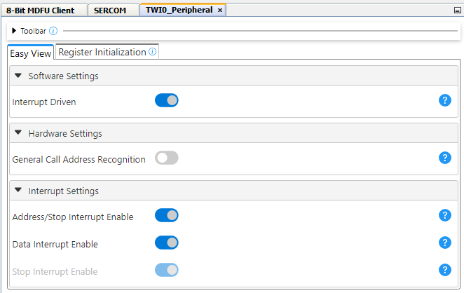
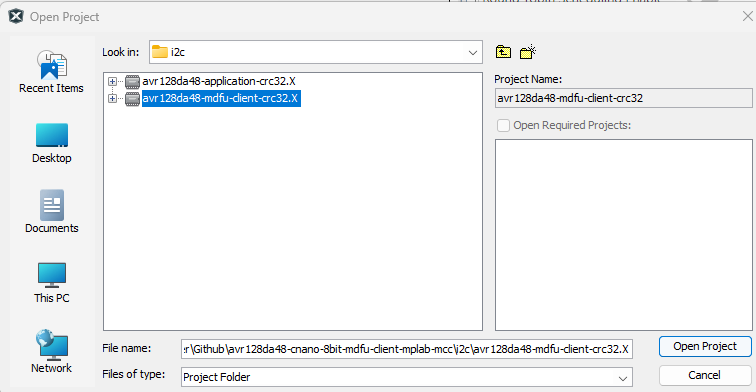
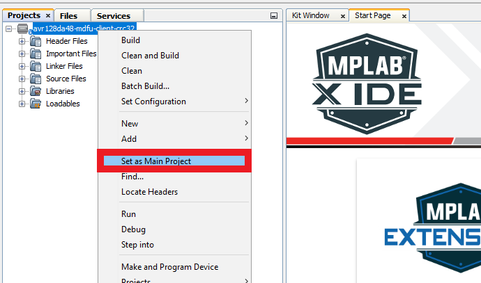

[](https://www.microchip.com)

# 8-Bit MDFU Client Setup for I<sup>2</sup>C Communication

[Go Back](../README.md)

## Required Hardware
- [Curiosity Nano Base for Click boards™](https://www.microchip.com/en-us/development-tool/AC164162)
- [MCP2221A Breakout Module](https://www.microchip.com/en-us/development-tool/ADM00559)
- Three female-to-male jumper wires

## Hardware Configuration
[](../images/i2c/HardwareSetup_I2C.png)

## 8-Bit MDFU Client I<sup>2</sup>C Communication

- Communication Protocol: I2C
- Application Start Address (Set through Configuration Bits UI): 0x3000
- Device ID: 0x1E9708 (automatically added)
- I/O Pin Indicator: Enabled
- I/O Pin Entry: Enabled
- Memory Verification: CRC32

[](../images/i2c/MDFUClientSetup_I2C.png)

**TWI**
- Custom Name: SERCOM
- Client Address: 0x20
- Client Mask: 0x0
- I2C Client PLIB Selector: TWI0

[](../images/i2c/I2CDriverSetup.png)

**TWI0 PLIB**
- Interrupt Driven: Enabled
- Address/Stop Interrupt Enable: Enabled
- Data Interrupt Enable: Enabled

[](../images/i2c/I2CPLIBSetup.png)

**TWI0 Pins**
- TWI SCL: PC3
- TWI SDA: PC2

[](../images/i2c/I2CPortsSetup.png)

**8-Bit MDFU Client I/O**
- BOOT INDICATE: PC6
- BOOT ENTRY: PC7

[](../images/i2c/IOPortSetup.png)

- BOOT INDICATE: Start High
- BOOT ENTRY: Weak Pull-up

[](../images/i2c/IOPinsSetup.png)

**Interrupt Settings**
- Global Interrupt Enable: Enabled
- Interrupt Vector Select Enable: Enabled

[](../images/i2c/InterruptSettings.png)

**8-Bit MDFU Client Project Properties**

Set the linker options to restrict the bootloader compilation to the BOOT partition.
This step is different depending on the used compiler.

*AVR-GCC:*

- When using the AVR-GCC compiler, open the Project Properties window and apply the below settings where `<Application Start Address>` is the start address of the application.
 ```
  avr-ld>Additional options>-Wl,--defsym,__TEXT_REGION_LENGTH__=<Application Start Address>
 ```

*XC8:*

- When using the XC8 compiler, open the Project Properties window and apply the below settings where `<Application Start Address>` is the start address of the application.
 ```
   XC8 Linker>Additional options>Extra Linker Options>-Wl,--defsym,__TEXT_REGION_LENGTH__=<Application Start Address>
 ```

Replace the `<Application Start Address>` to the Application Start Address value as configured in the MDFU Client UI.

[](../images/LinkerSettings_SPI.PNG)

### Application Setup
Refer to the [Application Setup](../README.md#application-setup) section in the main Readme file.

## Operation
This example shows how to execute the CRC32 verification example and update the device Flash memory with the CRC32 application image to demonstrate a successful device firmware update (DFU) over the I<sup>2</sup>C communication protocol.

**8-Bit MDFU Client Operation**

1. Open the MDFU client project.

[](../images/openBtnMDFU.png)

[](../images/i2c/openProjectMDFU_I2C.png)

2. Set the MDFU client project as Main Project.

[](../images/setAsMainProject_SPI.PNG)

3. Right click, then select **Clean and Build**.

[](../images/i2c/CleanAndBuildMDFU_I2C.png)

4. Program the MDFU client project.

[](../images/i2c/ProgramMDFU_I2C.png)

**Bootloader Operation after Initial Programming**

After initial programming, the LED must be ON.

[](../images/i2c/AVR128DA48_BootMode.png)

**Application Operation**
1. Open the Application Project configured for the selected verification scheme.

[](../images/openBtnApp_SPI.PNG)

[](../images/i2c/openProjectApp_I2C.png)

2. Set the application project as Main Project.

[](../images/setAppAsMainProject_SPI.PNG)

3. Build the application project.

- Navigate to the **Building** tab of the application Project Properties and enable the **Execute this line after build** checkbox.

[](../images/EnablePostBuildApp_SPI.PNG)

- Right click the project name, then select **Clean and Build**.

[](../images/i2c/CleanAndBuildApp_I2C.png)

4. Build the Application Image File using [pyfwimagebuilder](https://pypi.org/project/pyfwimagebuilder/).

- Navigate to the **Project** tab and right click on ***Important Files>`build_free_image.bat`*** for Windows or ***Important Files>`build_free_image.sh`*** for Mac and Linux.
- Select **Run**.

[](../images/RunBuildScript_SPI.PNG)

**Example Command:**

Below is an example of the command used in the above step.

`pyfwimagebuilder build -i "application_hex_file.hex"  -c "mdfu_config_file.toml" -o output.img`

[](../images/i2c/avr_pyfwimagebuilder.png)

> **Tip**: The configuration TOML file is generated by the MDFU Client project.

[](../images/i2c/ConfigPathExample_I2C.png)

5. Use the [pymdfu](https://pypi.org/project/pymdfu/) host tool to transfer the application image file to the bootloader.

- Navigate to the **Project** tab and right click, ***Important Files>`pymdfu_update.bat`*** for Windows or ***Important Files>`pymdfu_update.sh`*** for Mac and Linux. Double click to open the file.
- Then right click on the script and select **Run**.

[](../images/i2c/runUpdateScript_I2C.PNG)

**Example Command:**

Below is an example of the command used in the above step.

`pymdfu update --tool mcp2221a --image ./output.img --interface i2c --address 32 --clk-speed 100k`

[](../images/i2c/SendTheImage.png)

**Application Has Been Updated Successfully**

[](../images/i2c/AVR128DA48_AppMode.gif)

[Back to top](#8-bit-mdfu-client-setup-for-i2c-communication)
